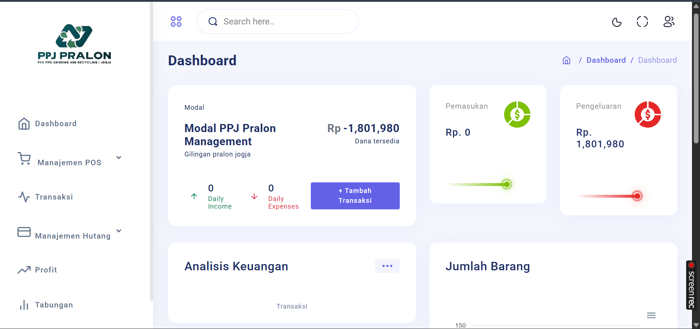

# PPJ Pralon Management System

## Overview
PPJ Pralon Management System is a web-based application designed to manage PVC pipe grinding and recycling operations efficiently. The system provides features for managing transactions, inventory, customers, and financial analysis.

## Features
- **Dashboard**: Overview of daily income, expenses, and financial analysis.
- **Transaction Management**: Add, view, and manage transactions with detailed records of income and expenses.
- **POS Management**: Manage point-of-sale operations, including product data, customer data, and category data.
- **Financial Analysis**: Analyze financial data to track profits and expenses.
- **Savings Management**: Manage savings and track balances.
- **User Authentication**: Secure login and account management.

## Screenshots

### Dashboard


### Transaction Management


### POS Management


### Landing Page


### Login Page


## Installation
1. Clone the repository:
   ```bash
   git clone <repository-url>
   ```
2. Navigate to the project directory:
   ```bash
   cd template
   ```
3. Create and activate a virtual environment:
   ```bash
   python -m venv .venv
   .venv\Scripts\activate
   ```
4. Install dependencies:
   ```bash
   pip install -r requirements.txt
   ```
5. Apply migrations:
   ```bash
   python manage.py migrate
   ```
6. Run the development server:
   ```bash
   python manage.py runserver
   ```

## Usage
1. Open your browser and navigate to `http://127.0.0.1:8000`.
2. Log in using your credentials.
3. Use the dashboard to manage transactions, inventory, and financial data.

## Contributing
Feel free to fork this repository and submit pull requests. For major changes, please open an issue first to discuss what you would like to change.

## License
This project is licensed under the MIT License.